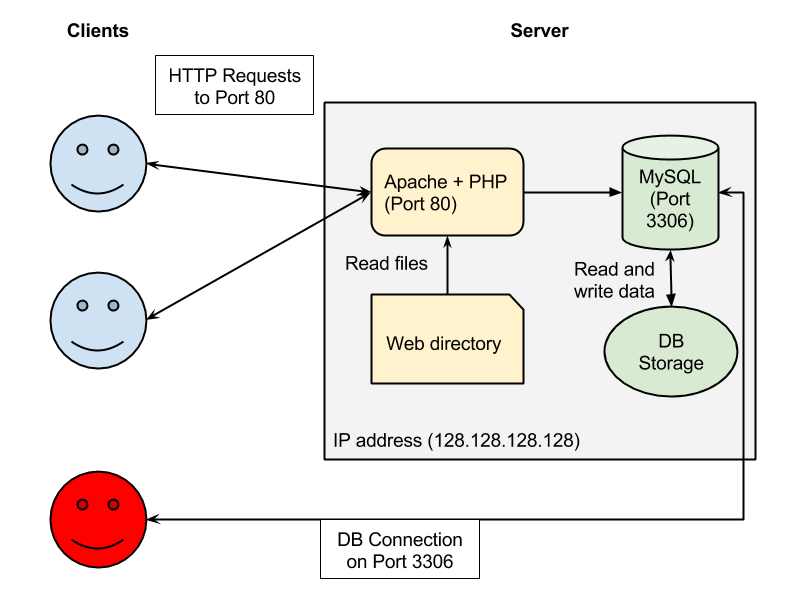

# Database Part 2: Querying In The Real World

Created and presented by Tahir Butt <tahir.butt@gmail.com> on October 13, 2016.

## Motivation: Pay attention to the database behind the curtain

[](https://www.youtube.com/watch?v=-RQxD4Ff7dY)

In this workshop, we will channel the spirit of Toto in the much beloved [The Wizard of Oz](https://en.wikipedia.org/wiki/Terry_(dog)). In this memorable scene where the "Great Oz" dismisses the pleas of Dorothy, Toto pulls back a curtain to reveal an elderly man operating a machine. When discovered, he instructs his frightened visitors to "Pay no attention to that man behind the curtain!" 

We will refuse to be cowered by the Wizard, at least when it comes to databases. As you will learn through this workshop, the magic behind much of the software we use daily, often without considering the machines hidden from view, depend crucially on databases. Having pulled aside the curtain, we can begin to ask our computers questions we might not have previously been able to articulate, even to ourselves. The mechanics and logic you will learn in this workshop pertain to relational databases, one of many kinds of databases, though still the most important to many of our desktop and web applications. 

The guiding principle behind relational databases is that they allow us to structure our data so as to avoid duplicating the same information. This is accomplished by organizing similar kinds of data into separate tables and by linking these tables together with relationships. The term *schema* refers to the collection of tables and relationships we create in a database. We could spend a whole workshop on how to create an efficient and robust database schema. Instead, we will take as a starting point the schemas used by Wordpress and Zotero. For now, the introduction provided by the first database owrkshop will be sufficient to get going. And like in the first workshop, we will communicate with relational databases by using a Structured Query Language (SQL).

<!--
Ask better questions of databases. Experitise in the syntax is less important than the kind of questions we can ask once we appreciate the structure of a relational database. Make concrete our vague questions. Move from big thinking to the weeds.
-->

## Preparation

Participants in the workshop are asked to have completed the following steps before the workshop. If you have any difficulties, please arrive 15 minutes before the workshop so issues can be sorted out.

1. If you attended [the first database workshop](https://digitalfellows.commons.gc.cuny.edu/2016/04/08/fun-times-with-sqlite-or-a-beginners-tutorial-to-data-management-and-databases-with-sql/) you will have already installed SQLiteStudio. For those who did not, you will want to download and install [SQLiteStudio](http://sqlitestudio.pl/?act=download).
2. Optional: Download [Docker for Windows](https://download.docker.com/win/stable/InstallDocker.msi) or [Docker for Mac](https://download.docker.com/mac/stable/Docker.dmg) and follow the steps for installing on [Windows](https://docs.docker.com/docker-for-windows/#/step-1-install-docker-for-windows) or on [Mac](https://docs.docker.com/docker-for-mac/#/step-1-install-and-run-docker-for-mac). Also, download the [QueryingInTheRealWorld](https://github.com/GCDigitalFellows/QueryingInTheRealWorld) repository.

If you are interested in the optional step, great! If not, no sweat! We will have a shared Wordpress server for the workshop that anyone who does not want to follow the optional step will be able to use. 

For those going ahead with the optional step, a few notes:
- We use [Docker](http://www.docker.com/) to create our own Wordpress server. Docker is an amazing piece of software that simplifies running software like web servers and databases. In our case, Docker allows us to create a safe environment to play in without effecting the normal behavior of our own computers. 
- The provided `docker-compose.yml` file for [docker-compose](https://docs.docker.com/compose/wordpress/) specifies all the necessary software and data that needs to be installed for this workshop. The installed software includes a web server with [Wordpress](https://wordpress.org/) and [PHPMyAdmin](https://www.phpmyadmin.net/) configured and links both to a [MySQL](http://www.mysql.com/) database server using [MariaDB](https://mariadb.org/), a fully compatible replacement for MySQL. The `docker-compose` command will also populate the `qitrw` database we will use for Wordpress with [sample data](https://github.com/poststatus/wptest) based on test data created for Wordpress theme and plugin developer.

## Wordpress Database

The following diagram is a simplified representation of the components of a Wordpress server:



The blue colored clients represent the normal interaction we will have had with a Wordpress server. We communicate with the Wordpress web server (a combination of Apache and PHP) using our web browsers. If we create a post or edit a category, those and any other changes are made by updating a MySQL database that the Wordpress web server has access to. Today we will get to play the red colored client and connect directly to the database to ask questions we might not be readily able to from the Wordpress administration dashboard.

The [database](https://codex.wordpress.org/Database_Description) created by a fresh Wordpress install already has numerous tables that are connected through the use of the primary keys in each table. While the [full diagram](https://codex.wordpress.org/images/2/25/WP4.4.2-ERD.png) of the schema is useful for reference purposes, we will focus here on three tables: `wp_users`, `wp_posts`, and `wp_comments`. I have copied here the relevant statements, simplified for our purposes, from the `bootstrap/db/00-load.sql` in the workshop repository.

```sql
CREATE TABLE `wp_users` (
  `ID` bigint(20) UNSIGNED NOT NULL,
  `user_login` varchar(60) ... NOT NULL DEFAULT '',
  `user_pass` varchar(255) ... NOT NULL DEFAULT '',
  `user_nicename` varchar(50) ... NOT NULL DEFAULT '',
  `user_email` varchar(100) ... NOT NULL DEFAULT '',
  `user_url` varchar(100) ... NOT NULL DEFAULT '',
  `user_registered` datetime NOT NULL DEFAULT '0000-00-00 00:00:00',
  `user_activation_key` varchar(255) ... NOT NULL DEFAULT '',
  `user_status` int(11) NOT NULL DEFAULT '0',
  `display_name` varchar(250) ... NOT NULL DEFAULT ''
) ...;

CREATE TABLE `wp_posts` (
  `ID` bigint(20) UNSIGNED NOT NULL,
  `post_author` bigint(20) UNSIGNED NOT NULL DEFAULT '0',
  `post_date` datetime NOT NULL DEFAULT '0000-00-00 00:00:00',
  `post_date_gmt` datetime NOT NULL DEFAULT '0000-00-00 00:00:00',
  `post_content` longtext ... NOT NULL,
  `post_title` text ... NOT NULL,
  `post_excerpt` text ... NOT NULL,
  `post_status` varchar(20) ... NOT NULL DEFAULT 'publish',
  `comment_status` varchar(20) ... NOT NULL DEFAULT 'open',
  `ping_status` varchar(20) ... NOT NULL DEFAULT 'open',
  `post_password` varchar(20) ... NOT NULL DEFAULT '',
  `post_name` varchar(200) ... NOT NULL DEFAULT '',
  `to_ping` text ... NOT NULL,
  `pinged` text ... NOT NULL,
  `post_modified` datetime NOT NULL DEFAULT '0000-00-00 00:00:00',
  `post_modified_gmt` datetime NOT NULL DEFAULT '0000-00-00 00:00:00',
  `post_content_filtered` longtext ... NOT NULL,
  `post_parent` bigint(20) UNSIGNED NOT NULL DEFAULT '0',
  `guid` varchar(255) ... NOT NULL DEFAULT '',
  `menu_order` int(11) NOT NULL DEFAULT '0',
  `post_type` varchar(20) ... NOT NULL DEFAULT 'post',
  `post_mime_type` varchar(100) ... NOT NULL DEFAULT '',
  `comment_count` bigint(20) NOT NULL DEFAULT '0'
) ...;

CREATE TABLE `wp_comments` (
  `comment_ID` bigint(20) UNSIGNED NOT NULL,
  `comment_post_ID` bigint(20) UNSIGNED NOT NULL DEFAULT '0',
  `comment_author` tinytext ... NOT NULL,
  `comment_author_email` varchar(100) ... NOT NULL DEFAULT '',
  `comment_author_url` varchar(200) ... NOT NULL DEFAULT '',
  `comment_author_IP` varchar(100) ... NOT NULL DEFAULT '',
  `comment_date` datetime NOT NULL DEFAULT '0000-00-00 00:00:00',
  `comment_date_gmt` datetime NOT NULL DEFAULT '0000-00-00 00:00:00',
  `comment_content` text ... NOT NULL,
  `comment_karma` int(11) NOT NULL DEFAULT '0',
  `comment_approved` varchar(20) ... NOT NULL DEFAULT '1',
  `comment_agent` varchar(255) ... NOT NULL DEFAULT '',
  `comment_type` varchar(20) ... NOT NULL DEFAULT '',
  `comment_parent` bigint(20) UNSIGNED NOT NULL DEFAULT '0',
  `user_id` bigint(20) UNSIGNED NOT NULL DEFAULT '0'
) ...;
```

Take note of the first column specified for each table. In each, we find an `ID` column that has the type `bigint(20)` (the `UNSIGNED` indicating that only positive numbers will be used) and which must always have a value (hence the use of `NOT NULL` without a default value, as is the case with other columns). Whenever a new record is added to any of these tables, a new ID is used so as to not conflict with an already existing record in the same table. The way databases prevent multiple records from having unique values for a column is through the use of "primary keys" and an "incrementing" number which in the case of a Wordpress database are specified by the following statements:

```sql
ALTER TABLE `wp_users`
  ADD PRIMARY KEY (`ID`),
  ...;

ALTER TABLE `wp_users`
  MODIFY `ID` bigint(20) UNSIGNED NOT NULL AUTO_INCREMENT, AUTO_INCREMENT=8;

ALTER TABLE `wp_posts`
  ADD PRIMARY KEY (`ID`),
  ...;

ALTER TABLE `wp_posts`
  MODIFY `ID` bigint(20) UNSIGNED NOT NULL AUTO_INCREMENT, AUTO_INCREMENT=1265;

ALTER TABLE `wp_comments`
  ADD PRIMARY KEY (`comment_ID`),
  ...;

ALTER TABLE `wp_comments`
  MODIFY `comment_ID` bigint(20) UNSIGNED NOT NULL AUTO_INCREMENT, AUTO_INCREMENT=32;
```

For now we can ignore the `ADD KEY` statements, which define the indexed columns of a database table. Instead, notice that after creating each table, each table is altered such that a `PRIMARY KEY` is added to each `ID` and that column is further modified to have the `AUTO_INCREMENT` option such that whenever a new record is added a new, unique value is inserted into the table. The primary keys are thus defined for `wp_users.ID`, `wp_posts.ID`, and `wp_comments.comment_ID`.

But you might have also noticed that `wp_posts` and `wp_comments` have other columns of type `bigint(20) UNSIGNED` but are not primary keys. Instead of primary keys, these other `_ID` columns enable our tables to relate to one another: `wp_posts.post_author` and `wp_comments.comment_author` contain the value of the appropriate `wp_users.ID` who created the post or comment; `wp_comments.comment_post_ID` contain the value of the appropriate `wp_post.ID` for which the comment was created.

## Zotero Database

One of the first applications I installed when I started graduate school was [Zotero](zotero.org). I use it pretty much every day, importing in articles and books I am finding through my research, annotating these items as I read them, and exporting bibliographies for papers I write. Over time, like many other graduate students, I have amassed a quite large Zotero library. Though hidden from plain sight, the Zotero application uses a database to store that library in an efficient and robust way. Without that database, it would be very easy to corrupt your library or a simple search for an author or a tag would be painfully slow. 

Download standalone, create account, add your favorite books and articles.

Fortunately for someone familiar with querying databases, we can access [the Zotero database without much headache](https://www.zotero.org/support/dev/client_coding/direct_sqlite_database_access) since Zotero uses [SQLite](https://www.sqlite.org/), a popular open source database engine used on [pretty much any computer or phone](https://www.sqlite.org/mostdeployed.html) you use daily.

The [Zotero Client Data Model](https://www.zotero.org/support/dev/data_model) is quite complex. We will focus on only a subset of the tables in this workshop. For those interested, you can examine the [full list of relationships](http://zomark.github.io/zotero-marc/schema/trunk/relationships.html) for the current data model.

In preparation for the workshop, first locate your [Zotero data directory](https://www.zotero.org/support/zotero_data). Because I use Zotero Standalone on a Windows computer, mine is located in:

```
C:\Users\tahir\AppData\Roaming\Zotero\Zotero\Profiles\cud5bmqj.default\zotero
```

You can find your folder by using clicking 'Preferences' in the 'Tools' menu drop-down. From there, select 'Advanced', then the 'Files and Folders' tab. Click the 'Show Data Directory' button in the 'Data Directory Location' section. This will bring open Finder (on OS X) or File Explorer (on Windows) with the directory where the `zotero.sqlite` file is stored.

Once you have found your data directory, make a copy of the `zotero.sqlite` file and store it in another folder, like on your Desktop. This step is to avoid the possibility that in accessing the database we might change it unwittingly and create many hours of headaches for ourselves later. After this workshop, you can delete the copy in your Downloads directory safely.